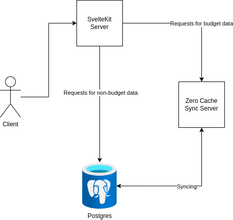
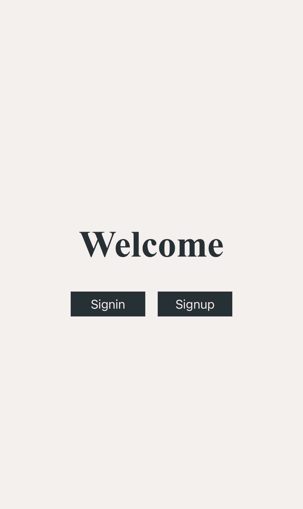
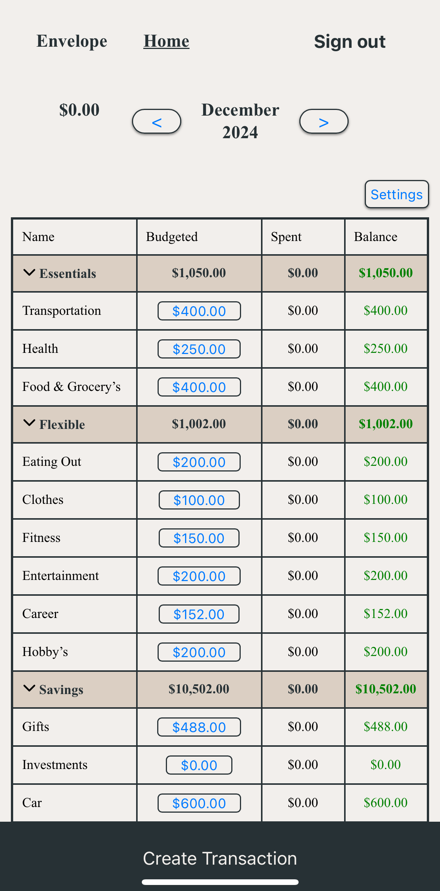
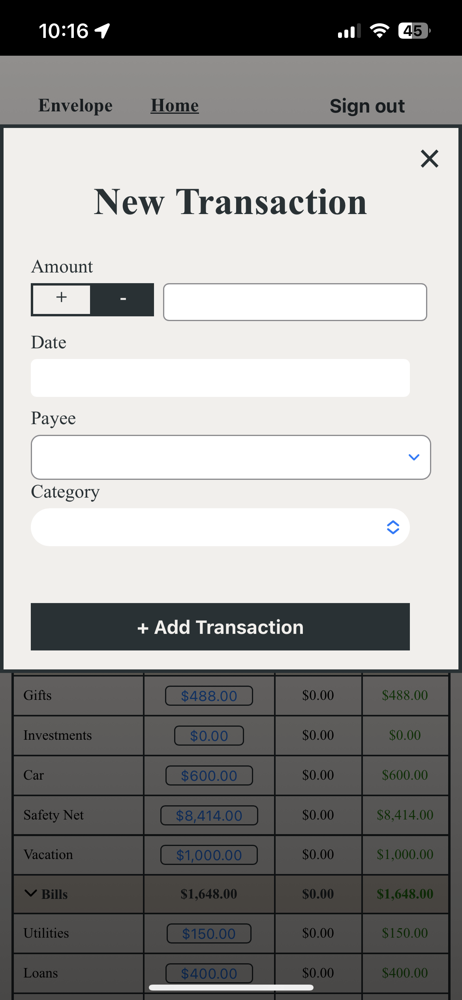

## Introduction
I built **Budget**, a personal budgeting application, to have more control over my finances without relying on paid services. It’s a web app built with **SvelteKit**, **Zero-cache**, and a **PostgreSQL database hosted on Fly.io**. The backend runs in **Docker containers**, and the app works both online and offline using **Index.db** and .

When used on mobile, Budget can be saved to the home screen and accessed like a native app. Offline changes are stored locally and synced automatically when back online, with Zero-cache handling the data synchronization.

In this post, I’ll go over why I built Budget, the technologies behind it, and how it all comes together.
## Envelope Budgeting
Envelope budgeting is a method of managing finances by allocating money into specific categories—traditionally using physical envelopes. Each envelope represents a spending category, such as groceries, rent, or entertainment, and you only spend what’s in each envelope. When an envelope is empty, you either stop spending in that category or adjust by moving money from another envelope.

This approach helps create discipline around spending by making budgets more tangible. Even in digital form, the envelope method remains useful for controlling expenses and ensuring money is allocated purposefully. Many modern budgeting apps replicate this system, allowing users to track their categories virtually instead of using physical cash.

Budget follows a similar principle by allowing users to categorize their spending and track their finances in a structured way. With offline support and automatic syncing, it provides a local-first alternative to traditional envelope budgeting apps.
## Data Flow in Budget

Budget follows a **local-first architecture**, meaning data is first stored on the user’s device and later synced with the backend when an internet connection is available. Here's how data flows through the system:

1. **User Interaction (Frontend - SvelteKit)**
    
    - A user enters a transaction, updates a budget category, or modifies financial data through the **SvelteKit frontend**.
        
    - These actions are handled locally first to ensure responsiveness and offline support.
        
2. **Local Storage & Caching (Zero-Cache & IndexedDB)**
    
    - **Zero-cache** intercepts all changes and saves them to the user’s **IndexedDB** (a built-in browser database).
        
    - This ensures that even if the user is offline, their data remains available and can be accessed instantly.
        
3. **Background Syncing (Zero-Cache Directly to PostgreSQL on Fly.io)**
    
    - When an internet connection is detected, **Zero-cache** automatically syncs the locally stored changes **directly to PostgreSQL** on Fly.io.
        
    - Zero-cache ensures data consistency, handling any conflicts or merge issues.
        
4. **Retrieving Data (Syncing Updates Back to the User)**
    
    - When the user accesses the app while online, Zero-cache pulls the latest updates from **PostgreSQL** and keeps **IndexedDB** up to date.
        
    - This ensures that the user always has the most recent data stored locally for offline access.
## Photo Demo

    
    
    

### Explanation

Using Budget starts with a simple setup process, allowing users to structure their finances based on the **envelope budgeting** method. Here's how it works:

1. **Registering an Account**
    
    - The first step is to **create an account**. This allows users to save and sync their data across devices while maintaining offline access.
        
2. **Setting Up Categories & Budgets**
    
    - Users create **category groups** (e.g., Essentials, Savings, Entertainment).
        
    - Within each group, they define **specific categories** (e.g., Rent, Groceries, Subscriptions).
        
    - At the start of each month, they assign a **budget amount** to each category, deciding how much they plan to spend.
        
3. **Adding Income**
    
    - When they receive a paycheck, users add their **income** to the app.
        
    - They then **allocate the funds** across their budget categories, following the envelope budgeting method—ensuring every dollar is assigned a purpose.
        
4. **Tracking Expenses with Transactions**
    
    - As users spend money, they record **transactions**, which deduct from the assigned category budgets.
        
    - They can see how much remains in each category, helping them stay within their spending limits.
        
5. **Adjusting and Reviewing**
    
    - Throughout the month, users can adjust their budget by moving money between categories as needed.
        
    - At the end of the month, they can review their spending and plan for the next cycle.
        

With **offline support** and automatic syncing, users can access and update their budget anytime, ensuring they stay on top of their finances without needing a constant internet connection.
## Links
- Budget Repo: [Github](https://github.com/jgrove2/budget)
- Actual Link: http://envelope-budget.fly.dev/
